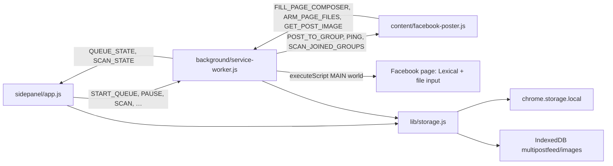
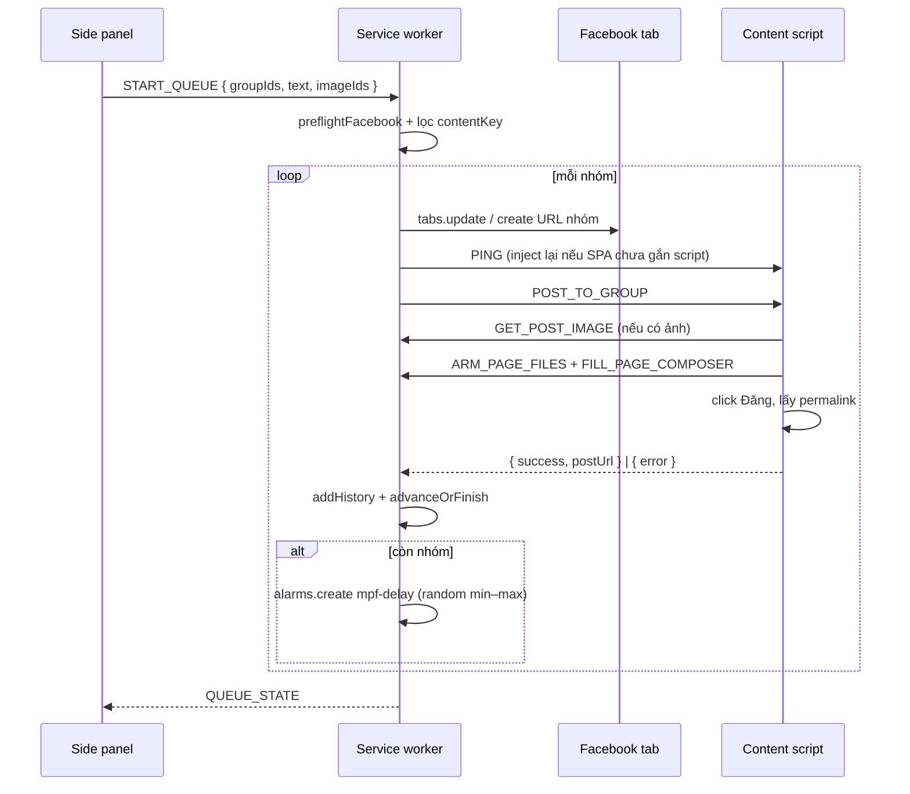

# Kiến trúc MultiPostFeed

Tài liệu kỹ thuật. Cách cài và dùng nằm ở [README.md](../README.md).

Repo **MultiPostFeed**, index GitNexus ~564 symbols / 50 execution flows (cập nhật 2026-09-14).

## Tổng quan

Ba tầng nói chuyện qua `chrome.runtime` / `chrome.tabs` message. Không có server.



| Tầng | Vai trò |
| --- | --- |
| Side panel | Soạn bài, chọn nhóm, điều khiển hàng đợi, render lịch sử. Không đụng DOM Facebook. |
| Service worker | Orchestrator: preflight, tab, timeout, delay, dedup, recover sau restart. |
| Content script | Isolated world: tìm composer, click, scan nhóm. Gọi SW khi cần MAIN world. |
| MAIN world inject | Ghi Lexical editor và hook `HTMLInputElement.click` / `showPicker` để gắn file. |

`lib/groups.js` parse URL nhóm, dùng chung side panel và service worker. Content script tự giữ một bản `GROUP_PATH_SKIP` vì không import ES module.

## Lưu trữ

### `chrome.storage.local`

| Key | Nội dung |
| --- | --- |
| `mpf_groups` | `[{ id, name, url, addedAt }]` — `id` = `grp_<slug>` |
| `mpf_settings` | `{ delayMinSeconds, delayMaxSeconds, delaySeconds }` — `delaySeconds` = max (tương thích cũ) |
| `mpf_draft` | `{ text, imageIds, selectedGroupIds }` |
| `mpf_history` | Tối đa 200 entry, mới nhất đầu mảng |
| `mpf_queue` | Snapshot hàng đợi; `createIdleQueue()` là trạng thái nghỉ |

Delay hợp lệ 20–180 giây. Setting cũ chỉ có `delaySeconds` được suy ra thành `[max(20, delay-15), delay]`.

### IndexedDB `multipostfeed` / store `images`

Mỗi ảnh: `{ id, name, mime, blob, createdAt }`. Side panel nén JPEG trước khi `putImage`. Content script không đọc IndexedDB trực tiếp — xin ảnh qua `GET_POST_IMAGE` (base64).

### History entry

```js
{
  id, jobId, groupId, groupName, url,
  contentKey,   // createContentKey(text, imageIds) = `${trim(text)}::${sortedIds}`
  textPreview,  // 140 ký tự
  postUrl, status, error, at
}
```

`status`: `posted` | `failed` | `skipped`. Khi `START_QUEUE`, nhóm đã có `posted` + cùng `contentKey` bị loại khỏi hàng đợi.

## Hàng đợi

### Trạng thái job

| `state.status` | Ý nghĩa |
| --- | --- |
| `idle` | Không chạy. `finishQueue` giữ `items` để hiện kết quả. |
| `running` | Đang xử lý một nhóm (`postingLock`). |
| `delaying` | Chờ `chrome.alarms` `mpf-delay` tới `delayEndsAt`. |
| `paused` | Người dùng tạm dừng, hoặc SW vừa khởi động lại lúc `running`. |

Item: `pending` → `posting` → `posted` | `failed` | `skipped` | `cancelled`.

### Vòng đời một nhóm



Đăng thất bại **không dừng hàng đợi**: đánh `failed`, ghi lịch sử, delay rồi sang nhóm kế. Lỗi cứng (mất tab, không PING được) qua `pauseWithError` — cũng skip và tiếp tục, trừ khi đang `pauseRequested`.

### Điều khiển

- **Pause lúc `running` + `postingLock`:** đặt `pauseRequested`, đợi bài hiện tại xong rồi mới `paused` — tránh đăng trùng khi Resume.
- **Resume:** item đang `posting` bị reset về `pending` rồi chạy lại nhóm đó.
- **Skip:** hủy alarm, đánh `skipped`, sang nhóm kế **không delay**.
- **Stop:** pending/posting → `cancelled`, state về idle.
- **Restart SW khi `running`:** ép `paused` + thông báo tiếp tục.
- **Restart SW khi `delaying`:** tạo lại alarm nếu còn > 1 giây, không thì `continueAfterDelay`.

Hằng số thời gian trong service worker:

| Hằng số | Giá trị |
| --- | --- |
| `POST_TIMEOUT_MS` | 120_000 |
| `TAB_WAIT_MS` | 25_000 |
| `PING_WAIT_MS` | 20_000 |
| `SCAN_TIMEOUT_MS` | 120_000 |

## Message protocol

### Side panel → service worker

| `type` | Payload | Kết quả |
| --- | --- | --- |
| `START_QUEUE` | `groupIds`, `text`, `imageIds` | `{ ok, state }` hoặc `{ ok:false, error }` |
| `PAUSE_QUEUE` / `RESUME_QUEUE` / `SKIP_CURRENT` / `STOP_QUEUE` | — | `{ ok, state }` |
| `GET_CURRENT_GROUP` | — | `{ ok, group }` từ tab `/groups/<slug>` |
| `SCAN_JOINED_GROUPS` | — | `{ ok, added, skipped, total, addedIds, message }` |
| `GET_STATE` | — | snapshot hàng đợi |

### Service worker → side panel (broadcast)

| `type` | Khi nào |
| --- | --- |
| `QUEUE_STATE` | Sau mọi `persistAndBroadcast` |
| `SCAN_STATE` | Quét nhóm: `running` / `done` / `idle` |
| `SCAN_PROGRESS` | Content script báo số nhóm đã thấy (SW forward) |

### Service worker ↔ content script

| `type` | Hướng | Việc |
| --- | --- | --- |
| `PING` | SW → CS | Script đã sẵn sàng? Trang nhóm / joins? |
| `POST_TO_GROUP` | SW → CS | `text`, `imageIds` |
| `SCAN_JOINED_GROUPS` | SW → CS | Cuộn `/groups/joins`, thu thập `{ slug, name, url }` |
| `GET_POST_IMAGE` | CS → SW | `{ imageId }` → `{ dataBase64, name, mime }` |
| `FILL_PAGE_COMPOSER` | CS → SW | Inject MAIN world, ghi Lexical |
| `ARM_PAGE_FILES` / `DISARM_PAGE_FILES` | CS → SW | Hook file input với `File` tạo từ base64 |

## Content script: đăng bài

`postToGroup` trong `content/facebook-poster.js`:

1. Xác nhận URL là trang nhóm (không phải `feed`, `joins`, `discover`, …).
2. `openComposer` — click trigger theo nhãn VI/EN (*Viết gì đó*, *Photo/video*, …).
3. **Gắn ảnh trước** (Facebook hay rebuild dialog khi thêm media, làm mất chữ).
4. Tìm textbox, `fillText` (Lexical MAIN world, fallback `execCommand` / `InputEvent`).
5. `clickPostButton` (*Đăng* / *Post*).
6. Chờ dialog đóng (15s). Còn mở → coi như Facebook đang hỏi xác nhận, trả lỗi.
7. `findPostedPermalink`: toast *Đã đăng* / *pending*, hoặc article mới trên feed (điểm theo snippet + “vừa xong”).

Một lúc chỉ một `POST_TO_GROUP` (`postingInFlight`).

Gắn ảnh: `ARM_PAGE_FILES` cài hook `HTMLInputElement.prototype.click` / `showPicker` ở MAIN world, gán `DataTransfer` khi input file không nằm trong feed. Fallback: drop files lên composer.

## Quét nhóm đã tham gia

1. Side panel gửi `SCAN_JOINED_GROUPS`.
2. SW mở/tái sử dụng tab `https://www.facebook.com/groups/joins`.
3. CS cuộn, bấm *Xem thêm*, thu thập link `/groups/<slug>`, gửi `SCAN_PROGRESS`.
4. SW `mergeScannedGroups` theo slug: nhóm mới được thêm; nhóm cũ giữ nguyên, chỉ cập nhật `name` nếu tên đang là slug.

Không quét khi hàng đợi `running` / `delaying`.

## Side panel

`sidepanel/app.js` hydrate từ storage rồi subscribe message.

- Form bị khóa khi `running` | `delaying` | `paused`.
- Delay countdown đọc `delayEndsAt`.
- `normalizeFilter` bỏ dấu tiếng Việt khi lọc lịch sử.
- Ảnh: `createImageBitmap` → `OffscreenCanvas` → JPEG.

## URL nhóm

`parseGroupUrl` chỉ nhận host `facebook.com` / `web.facebook.com` và pathname `/groups/<slug>/`. Slug bị loại: `feed`, `joins`, `discover`, `notifications`, `creates`, `search`.

## Điểm dễ gãy khi Facebook đổi UI

- Nhãn composer / nút Đăng / Photo-video (mảng `COMPOSER_TRIGGERS`, `POST_LABELS`, …).
- Cấu trúc Lexical / React fiber (`__lexicalEditor`, `__reactFiber$`).
- Dialog `[role="dialog"]` và textbox `contenteditable`.
- Trang `/groups/joins` đổi layout → scan thiếu nhóm.
- Permalink (toast / `story_fbid` / `/posts/` / `/permalink/`).

Sửa content script và hàm MAIN world trong service worker trước; side panel ít phụ thuộc DOM Facebook.
